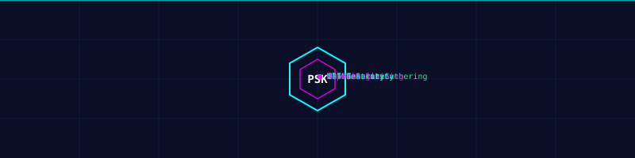

<div align="center">
  
</div>

<br>

<div align="center">


[](https://python.org)
[](https://termux.dev)
[](LICENSE)
[]()
[]()

[](https://github.com/ethicalpareek-sys/pareek-security-kit/stargazers)
[](https://github.com/ethicalpareek-sys/pareek-security-kit/network/members)

<br>


<br>

> ⚠️ **Ethical Use Only** — Test only systems you own or have **explicit written authorization** to test.

</div>

---

## 🌟 Why Pareek?

<table>
<tr>
<td width="50%">

### 🎯 Core Strengths

- ✅ **100% original code**
- 📱 **Termux-native** (no root needed)
- 🧩 **19 independent modules**
- 🎨 **3D gradient CLI**
- 🔒 **Safe subprocess** (no shell)
- 🛡️ **Auto secret redactor**
- ⚡ **Thread-safe rate limiter**
- 📊 **4 output formats**

</td>
<td width="50%">

### 🚀 Next-Level

- 🌈 **True-color 256-bit gradients**
- ⏱️ **Animated loaders**
- 🔍 **Dependency matrix**
- 📝 **Rotating log files**
- 🎯 **Cross-platform**
- 🧠 **Adaptive colors**
- 🛠️ **Modular architecture**
- 📜 **MIT licensed**

</td>
</tr>
</table>

---
📊 Project Stats

<div align="center">

<a href="https://github.com/ethicalpareek-sys/pareek-security-kit">
  
</a>


</div>

---

📜 License

<div align="center">


Copyright © 2025 Bharat Pareek

<a href="LICENSE">
  
</a>


Free to use · modify · distribute — attribution required.

</div>

---

👨‍💻 Author

<div align="center">

<a href="https://github.com/ethicalpareek-sys">
  
</a>


🌟 Bharat Pareek 🌟


<br>

<a href="https://github.com/ethicalpareek-sys">
  
</a>

📍 India 🇮🇳

Made with ❤️ by Bharat Pareek

</div>

---

<div align="center">


🚀 Educate · Defend · Protect

</div>

# Module Status
01 Information Gathering 🟡 Phase 2

02 Network Scanning 🟡 Phase 3

03 Service Enumeration 🟡 Phase 4

04 Web Security Testing 🟡 Phase 5

05 Packet Analysis 🟡 Phase 6
06 Network Diagnostics 🟡 Phase 6
07 Vulnerability Assessment 🟡 Phase 7
08 Wireless Security 🟡 Phase 8
09 Password Auditing 🟡 Phase 9
10 Credential Security 🟡 Phase 9
11 Exploit Lab 🟡 Phase 10
12 DNS Security 🟡 Phase 2
13 SSL/TLS Analysis 🟡 Phase 5
14 OSINT 🟡 Phase 7
15 Cloud Security 🟡 Phase 10
16 API Security 🟡 Phase 10
17 File Security 🟡 Phase 10
18 Reports 🟡 Phase 10
19 Dependency Checker 🟢 LIVE

🛠️ Tech Stack

<div align="center">


</div>

---


## 🚀 Quick Start

```bash
pkg update && pkg upgrade -y
pkg install python git curl openssl -y

git clone https://github.com/ethicalpareek-sys/pareek-security-kit.git
cd pareek-security-kit

python pareek.py --menu
python pareek.py --doctor

╔══════════════════════════════════════════════════════════════╗
║  ██████╗  █████╗ ██████╗ ███████╗███████╗██╗  ██╗            ║
║  ██╔══██╗██╔══██╗██╔══██╗██╔════╝██╔════╝██║ ██╔╝            ║
║  ██████╔╝███████║██████╔╝█████╗  █████╗  █████╔╝             ║
║  ██╔═══╝ ██╔══██║██╔══██╗██╔══╝  ██╔══╝  ██╔═██╗             ║
║  ██║     ██║  ██║██║  ██║███████╗███████╗██║  ██╗            ║
║  ╚═╝     ╚═╝  ╚═╝╚═╝  ╚═╝╚══════╝╚══════╝╚═╝  ╚═╝            ║
╠══════════════════════════════════════════════════════════════╣
║  S E C U R I T Y   K I T   v 2 . 0  ·  P H O E N I X          ║
╚══════════════════════════════════════════════════════════════╝


