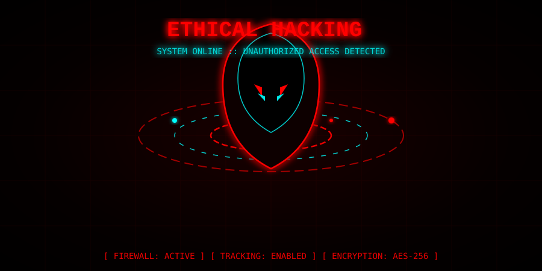

<div align="center">
  
</div>

<br>

<div align="center">


[](https://python.org)
[](https://termux.dev)
[](LICENSE)
[]()
[]()

[](https://github.com/ethicalpareek-sys/pareek-security-kit/stargazers)
[](https://github.com/ethicalpareek-sys/pareek-security-kit/network/members)

<br>


<br>

> ⚠️ **Ethical Use Only** — Test only systems you own or have **explicit written authorization** to test.

</div>

---

<div align="center">
  
</div>

<br>

<div align="center">
  
# 🛡️ PAREEK SECURITY KIT v2.0

[](https://github.com/ethicalpareek-sys/pareek-security-kit)

</div>

---

## 🤔 Why Pareek?

Bhai, ye tool kyun sabse alag aur powerful hai? Dekho:

- ⚡ **19 Powerful Modules** — Ek hi jagah sab kuch (DNS, Web, Cloud, OSINT).
- 📱 **Made for Termux** — Android phone par bina root ke chalta hai.
- 🐍 **Pure Python** — Koi extra heavy library nahi, sirf standard Python aur requests.
- 🎨 **Modern UI** — 3D banners, gradient colors, aur smooth animations.
- ⚙️ **Simple & Fast** — Threading use karta hai, isliye scan ekdum tez hota hai.
- 🔓 **Open Source** — MIT License, code poora transparent hai.

---

## 🛠️ Pareek Cybersecurity Kit: Tools Overview

Ye saare tools **ethical hacking aur authorized testing** ke liye hain. Simple language mein samjho:

| # | Module Name | Kaam Kya Karta Hai? |
|---|-------------|---------------------|
| 01 | Information Gathering | Domain ka DNS, WHOIS aur IP address dhoondhna. |
| 02 | Network Scanning | Netwrok ke ports aur live devices dhoondhna. |
| 03 | Service Enumeration | Kaunsi service (HTTP, FTP, SSH) chalu hai ye dekhna. |
| 04 | Web Security | Website ki SQLi, XSS, WAF jaisi vulnerabilities check karna. |
| 05 | Packet Analysis | Network ka data (packets) capture aur analyze karna. |
| 06 | Network Diagnostics | Internet speed, ping aur route (traceroute) check karna. |
| 07 | Vulnerability Assessment | System ki kamzoriya (CVE) dhoondhna aur score dena. |
| 08 | Wireless Security | Aas-paas ke WiFi aur unki security check karna. |
| 09 | Password Auditing | Password kitna strong hai aur crack hone mein time. |
| 10 | Credential Security | Data breaches aur leak hue passwords check karna. |
| 11 | Exploit Lab | CTF aur hacking practice ke liye tools. |
| 12 | DNS Security | DNSSEC, SPF, DMARC aur DNS leaks check karna. |
| 13 | SSL/TLS Analysis | Website ka HTTPS lock aur certificate check karna. |
| 14 | OSINT | Public data, username aur phone number dhoondhna. |
| 15 | Cloud Security | AWS, Azure, GCP aur S3 buckets ki security check. |
| 16 | API Security | JWT tokens aur API endpoints test karna. |
| 17 | File Security | Files ka hash, malware aur entropy analysis karna. |
| 18 | Reporting | Saari scanning ki report (JSON, HTML, CSV) banana. |
| 19 | Dependency Checker | Tool ke saare packages install hai ya nahi check karna. |

---

## ⚡ Quick Start (Termux / Linux)

Termux kholo aur ye commands ek-ek karke paste karo:

```bash
pkg update && pkg upgrade -y
pkg install python git curl -y
git clone https://github.com/ethicalpareek-sys/pareek-security-kit.git
cd pareek-security-kit
pip install -r requirements.txt
python pareek.py --menu


